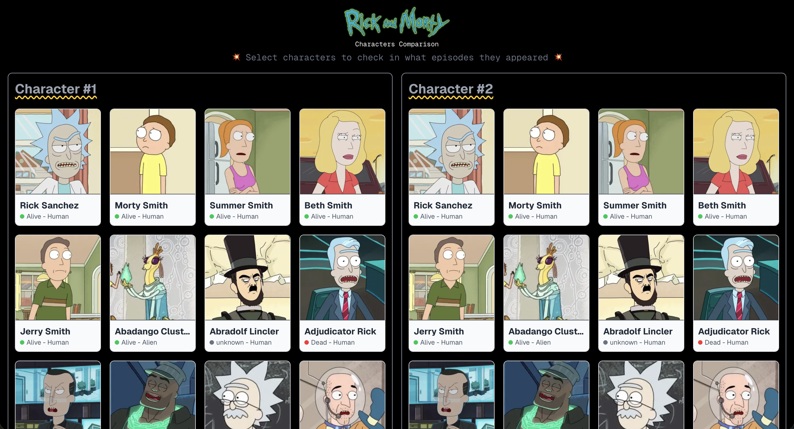
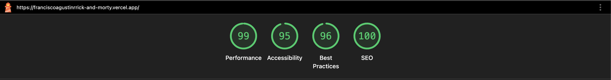

# Rick and Morty




Webapp desarrollada para comparar personajes de Rick and Morty y visualizar los episodios en los que aparecen.

## 🚀 Características

- Listado paginado de personajes
- Selección de dos personajes para comparación
- Visualización de episodios individuales y compartidos
- Responsive
- Type safety
- Componetización reutilizable
- Validaciones
- Manejo de errores y estados de carga
- Tests unitarios

## 🛠️ Tech Stack

- **Next.js**
- **TypeScript**
- **TailwindCSS**
- **Axios**
- **Jest & React Testing Library**

## 📦 Install

```bash
# Clonar el repo
git clone https://github.com/franciscoagustinr/rick-and-morty

# Instalar dependencias
npm i

# Ejecutar en desarrollo
npm run dev

# Construir para producción
npm run build

# Ejecutar tests
npm run test
```

## 📝 API Utilizada

[Rick and Morty API](https://rickandmortyapi.com/)

**Desarrollado por** | [Portfolio](https://franciscoagustinr.dev)
